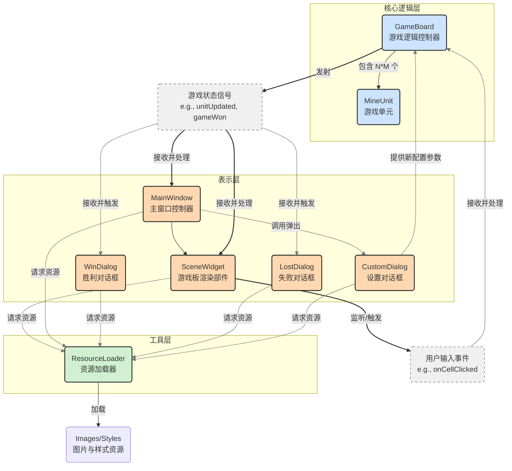

# MineSweeper_Touhou

一个使用了东方元素的扫雷小游戏，基于 WHUT 计算机编程强化训练大作业。

---

## 总体架构

## 功能特点

- 经典扫雷玩法，融入东方风格
- 支持多种难度（简单、普通、困难、自定义）
- 月相主题皮肤
- 排行榜功能（计划中）

## Todo 列表

- [x] 实现扫雷核心逻辑（地雷生成、揭开、标记、胜负判断）
- [x] 支持难度切换（简单、普通、困难、自定义）
- [ ] 前后端分离
- [x] 完成 UI 界面（网格绘制、鼠标交互、状态栏）
  - [x] 网格绘制
  - [x] 鼠标交互
  - [x] 状态栏
- [x] 实现月相主题皮肤（新月、上弦月、满月、残月）
- [ ] 添加排行榜功能（记录用时和难度）
- [x] 实现暂停和继续游戏功能

## 东方相关说明

本项目受《东方 Project》启发，采用月相主题设计，但不包含任何受版权保护的东方 Project 内容。所有资源（如图标、音效）均计划使用 CC0 许可的公开资源。

## 许可证

本项目采用 MIT 许可证。

